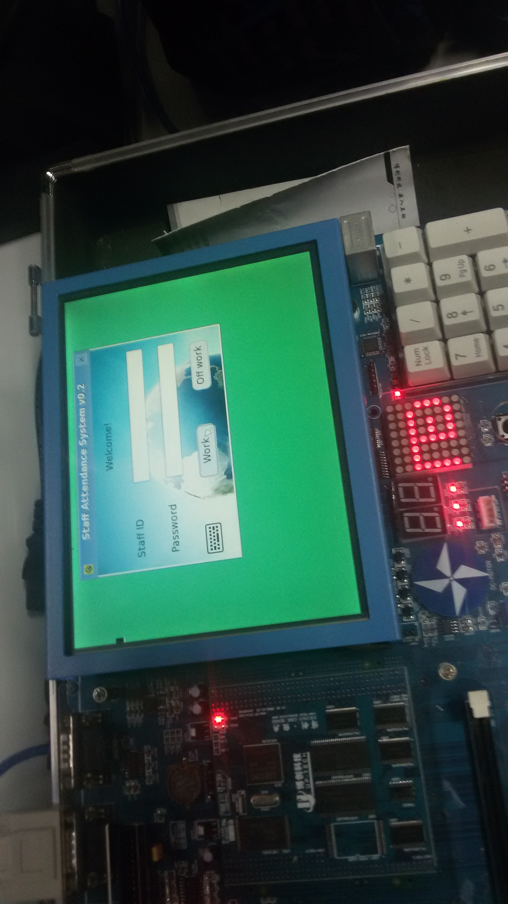
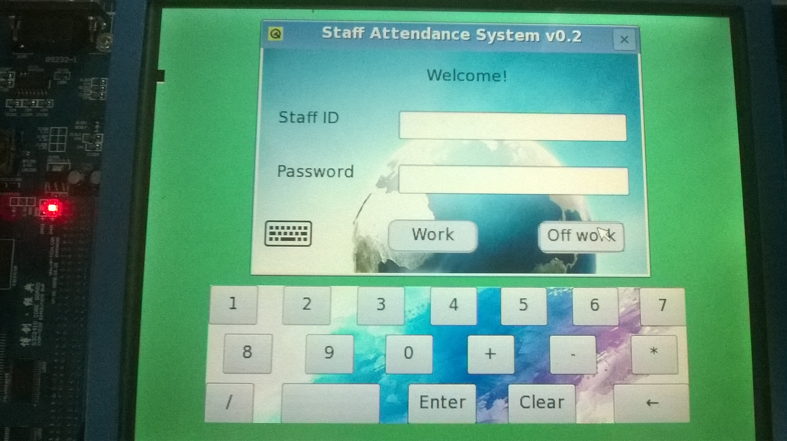
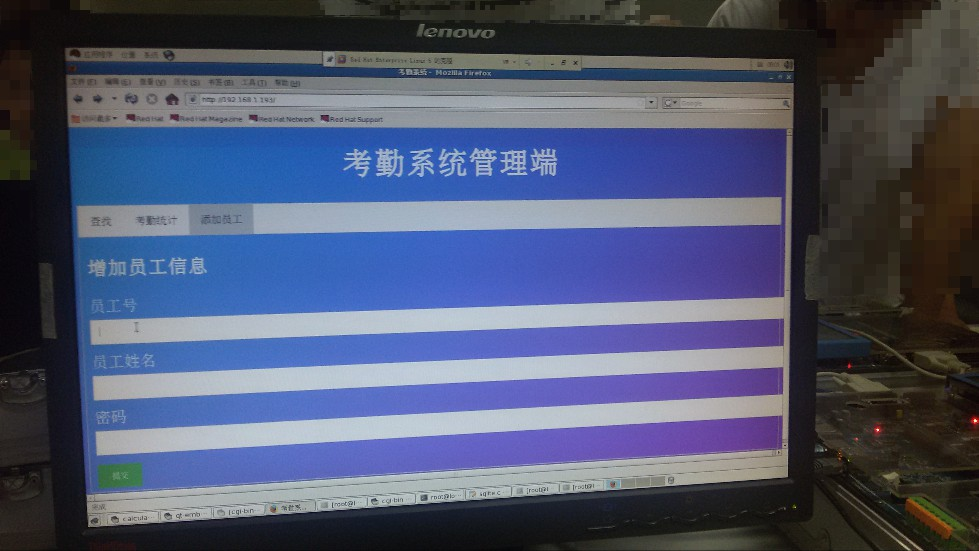
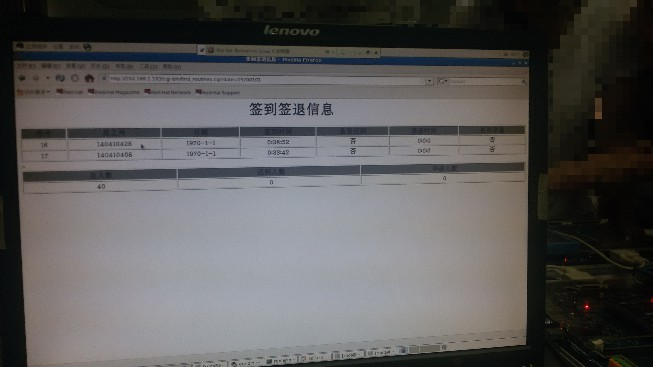

# 嵌入式考勤系统(Qt + Web)

ARM 开发板为三星的 S3C2410，开发系统为 RedHat Linux 5。Qt 版本为 qt-embedded-4.4.0。
- 使用前先安装 17 键小键盘的驱动模块：
```
# insmod mega8.ko 
# cat /proc/devices
......
251 Mega8-icc
252 Mega8-kbd
......
mknod /dev/Mega8-kbd c 252 0
```
- 数据库文件可用 SQLiteStudio 查看。







